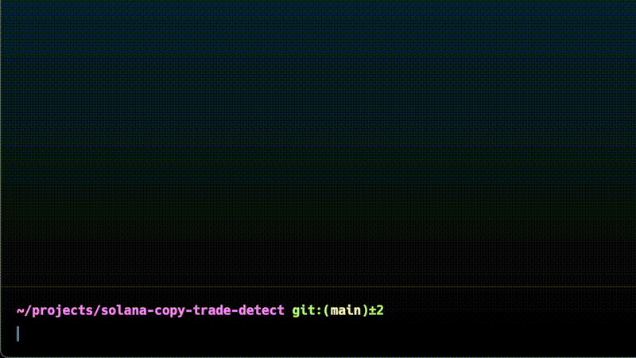
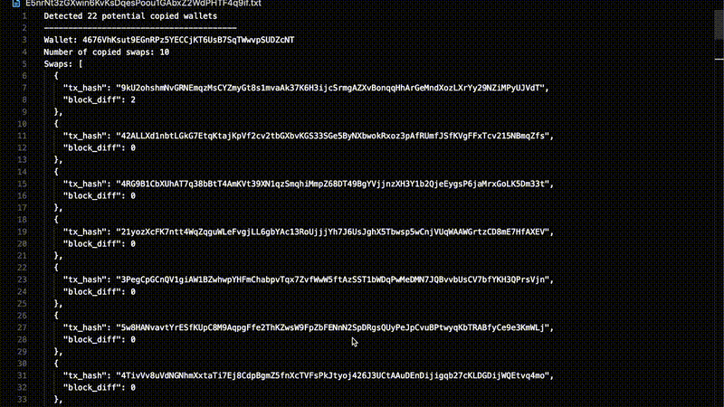

# Solana Copy Trade Detect

[](https://github.com/thelezend/solana-copy-trade-detect/actions/workflows/ci.yml)

> **IMPORTANT: I have developed a more efficient solution that no longer depends on Cielo or Shyft APIs. While I am not sharing this method publicly, it is available for purchase. Feel free to contact me on Discord for details.**

## Introduction

So, you've found a profitable Solana wallet after searching for hours on Dexscreener or Cielo and are ready to copy it. Why stop there? Take it a step further—analyze whether this wallet is copying another wallet or a group of wallets. Stay ahead of the competition and lead the way. This CLI program is built to help you do exactly that.

## Usage

It can be as simple as:



And then you'll get the output like this:



Another useful feature is that this program is built to integrate seamlessly with your existing scripts or programs right out of the box. You can use the pipe `|` operator to pipe the output to any desired app or backend service. The output in this case will be a JSON array of detected wallets and their transactions in the following format:

```json
[
    {
        "wallet": "CMcHRygKpNG2Jx83T1cTiqAvg55mYXv6uSwjhFzLwQFc",
        "txs": [
            {
                "tx_hash": "HM1SpwQku4TwjBzb99KvFTUM28P6qvXtsE9nx5ysXFHC2VpTn9zwSkQhu56FDVnTz9Y3W42FZCCQr5JVGX7ajmf",
                "block_diff": 0
            },
            {
                "tx_hash": "3RfNN2cSbBt7tmAC5XYqRMKtwyCmgKw6meuBbDGhdbZsbouQjiWR9eHVeXi95WUSzaKz6ci9wuhxte2r7kDXL5BV",
                "block_diff": 1
            }
        ]
    },
    {
        "wallet": "8H2B2caseWwaDerKgiPLrgMJR5En5A4fUk3zoEVXAb6F",
        "txs": [
            {
                "tx_hash": "4GVFcbibPNpGsNiRYvZ8F4aBHFmbZP18hpTb4BMoxw3z5QATkt2E18GPGUTadsN3wKrPKx87JK3VVig7k4AwBL3R",
                "block_diff": 0
            },
            {
                "tx_hash": "3f5C1ZqhQFEC7VDTgxL3jvfX6gXm28pP7gurBiFzBfd6jht9S16Ej4pU58EVRJNR8zNrU4hsxNMfv6K3MqQfHoUk",
                "block_diff": 1
            }
        ]
    }
]
```

- `wallet` is the potential wallet address that is being copied
- `txs` is an array of transactions of the detected wallet
- `tx_hash` is the transaction hash
- `block_diff` is the block difference between the transactions of the detected wallet and the original wallet

## Installation

You can directly download the pre-built binary executable for your OS and architecture from the [releases](https://github.com/thelezend/solana-copy-trade-detect/releases) page. If you prefer to verify the code, build it yourself, or need to use it on an OS without a binary release, you can easily build it from source. Plenty of Rust-related resources are available online to guide you through the process.

> **IMPORTANT: The program internally uses the Cielo Feed endpoint, which provides data specific to your Cielo account. For the program to function, the wallet being scanned must already be added to your Cielo watchlist (any list).**

- The program uses Cielo and Shyft APIs internally, so you need to set the corresponding API keys. You can pass them as options when running the program from the terminal, or set them as environment variables, or include them in a `.env` file in the same directory.
- As of this writing, both Cielo and Shyft offer free tier options. Which should be more than enough for most users.

Cielo: <https://build.cielo.finance/my-dashboard/plans>

Shyft: <https://shyft.to/dashboard/overview>

## Configuration

Use `help` to see the list of all available options:

```bash
solana-copy-trade-detect --help

Detects if a given Solana wallet is copy trading.

Usage: solana-copy-trade-detect [OPTIONS] --cielo-api-key <CIELO_API_KEY> --shyft-api-key <SHYFT_API_KEY> --wallet <WALLET>

Options:
  -c, --cielo-api-key <CIELO_API_KEY>  Cielo API key [env: CIELO_API_KEY=]
  -s, --shyft-api-key <SHYFT_API_KEY>  Shyft API key [env: SHYFT_API_KEY=]
  -r, --rpc-url <RPC_URL>              Solana RPC URL. The Shyft RPC endpoint is used by default if not provided [env: RPC_URL=]
  -w, --wallet <WALLET>                The wallet to scan
      --swap-num <SWAP_NUM>            Number of recent fresh swaps from the wallet to consider (max 100) [default: 15]
      --scan-tx-count <SCAN_TX_COUNT>  Number of transactions to scan for each swap to detect repeated wallets (max 100) [default: 50]
  -d, --delay-ms <DELAY_MS>            Delay between Shyft API requests in milliseconds [default: 500]
  -o, --output-file <OUTPUT_FILE>      Output file to write detected wallets. Default is wallet_address.txt
  -h, --help                           Print help
  -V, --version                        Print version
  ```

## Support and Contact

Feel free to customize and integrate the code as you like. If this has been helpful or profitable, and you’re feeling generous enough to pay for my gym subscription 😅, you can send Solana or any other token to my Solana wallet: `lezend.sol`

If you’d like me to build any app or tool, feel free to reach out to me on Discord.

## Code contributions

Your contributions are welcome! I would love to make this tool better or add new features. Please ensure your code follows the existing style and includes documentation, examples and tests for any new functionality.

For major changes, please open an issue first to discuss what you would like to change or feel free reach out to me on my socials, preferably Discord.

## License

This project is licensed under the MIT OR Apache-2.0 license.
